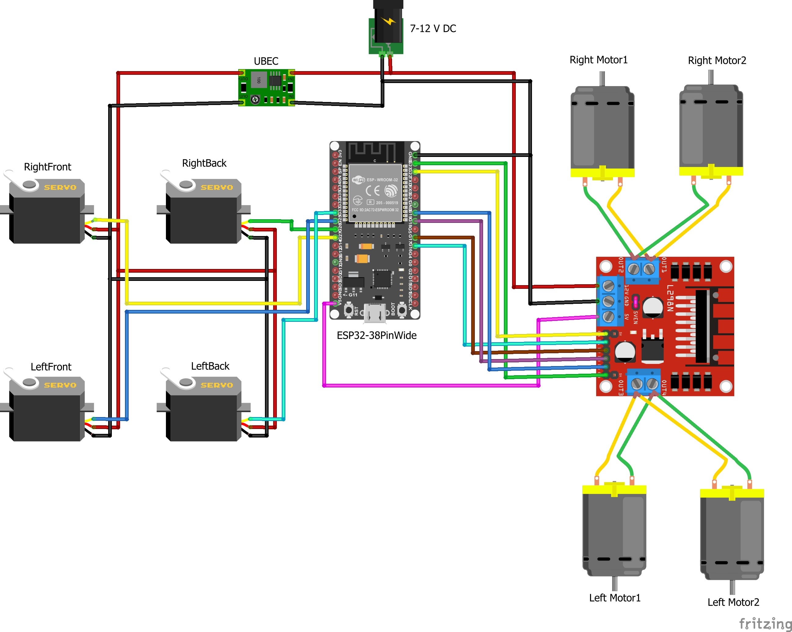

# 🌞 Solspot – Efficient Parallel Parking

A solar-powered smart vehicle prototype that performs efficient **parallel parking** in tight urban spaces. Controlled via a **WiFi-based ESP32 interface**, the system incorporates **360° rotating wheels**, **renewable energy via solar panels**, and optimized embedded components for sustainable smart parking.

---

## 📌 Table of Contents
- [Project Overview](#project-overview)
- [Features](#features)
- [System Architecture](#system-architecture)
- [Tech Stack](#tech-stack)
- [Circuit Diagrams](#circuit-diagrams)
- [Installation](#installation)
- [How It Works](#how-it-works)
- [Challenges Faced](#challenges-faced)
- [Contributors](#contributors)
- [License](#license)

---

## 🚗 Project Overview

Urban parking is a persistent issue, especially in congested areas. **Solspot** aims to simplify this using:
- Smart hardware integration (ESP32, Motor Drivers)
- Solar-powered energy efficiency
- Wireless control using a web interface

This project is a **prototype electric vehicle** that can autonomously or manually perform **parallel parking**, moving in any direction, and charging itself via a solar panel for sustainability.

---

## ✅ Features

- 🔋 **Solar-powered operation** for energy efficiency  
- 📶 **ESP32 web interface control** (no mobile app needed)  
- 🔄 **360° rotational movement** for precise parking  
- 🛠️ **Dual ESP32 setup** for transmitter and receiver communication  
- 🔌 **UBEC module integration** for voltage regulation  
- 🌐 **Mobile-responsive control dashboard**  

---

## 🧠 System Architecture

- **Transmitter** (Web UI): Sends user commands over WiFi  
- **Receiver** (ESP32-based vehicle): Interprets commands, controls motors  
- **Motor Driver**: L298N to control direction and power  
- **Solar Panel**: Charges onboard battery to minimize energy usage  
- **UBEC**: Maintains safe voltage levels across components  

---

## 🧰 Tech Stack

| Component         | Details                        |
|------------------|--------------------------------|
| Microcontroller  | ESP32 (2 units)                |
| Motor Driver     | L298N                          |
| Power Supply     | Solar Panel + Lithium Battery  |
| Voltage Regulator| UBEC                           |
| Interface        | Web-based (AsyncWebServer)     |
| Programming      | Arduino (C++)                  |
| Communication    | WiFi (no external router)      |

---

## 📷 Circuit Diagrams

**Figure 1:** Complete Circuit Diagram for Solspot  

This diagram illustrates the full connection between:
- ESP32 microcontrollers (transmitter and receiver)
- L298N motor driver module
- 360° rotating wheels
- Power system using solar panel, UBEC, and battery

Make sure the connections match exactly to ensure proper functionality and avoid over-voltage issues.

---

## 🔧 Installation

1. **Hardware Setup**
   - Assemble chassis, wheels, motor driver, ESP32, and solar panel.
   - Connect motor driver to ESP32 using GPIO pins.
   - Ensure UBEC regulates voltage to protect ESP32.

2. **Code Upload**
   - Use Arduino IDE with the ESP32 board manager installed.
   - Upload the transmitter and receiver code to respective ESP32 boards.
   - Install required libraries (e.g., `ESPAsyncWebServer`, `WiFi.h`).

3. **WiFi Setup**
   - Connect to ESP32-hosted WiFi network via browser.
   - Use control dashboard to maneuver the vehicle.

---

## 🛠️ How It Works

- ESP32 runs a local WiFi server.
- The web interface sends directional commands.
- Receiver ESP32 interprets and drives motors accordingly.
- Solar panel continuously charges the battery.

---

## 🚧 Challenges Faced

- Component mismatch and overvoltage issues  
- Incomplete libraries and upload failures  
- Difficulty sourcing appropriate solar panels and batteries  
- ESP32 web reliability under multiple requests  

All resolved through circuit redesign, proper voltage regulation, and debugging.

---
